# 🏗️ Diagrama de Arquitectura — Infraestructura del Sistema

> Representa cómo se comunican todos los componentes del ecosistema de microservicios del restaurante.  
> Generado con **Mermaid** — compatible con GitHub, GitLab, Confluence y VSCode (extensión Mermaid Preview).

---

## Diagrama Principal

```mermaid
flowchart TB
    %% ── CLIENTE EXTERNO ──────────────────────────────────────────
    CLIENT(["👤 Cliente\n(Postman / Navegador)"])

    %% ── CAPA DE INFRAESTRUCTURA ──────────────────────────────────
    subgraph INFRA["☁️  Capa de Infraestructura Spring Cloud"]
        EUREKA["🔍 eureka-server\n:8761\nServidor de Descubrimiento"]
        GATEWAY["🚪 api-gateway\n:8080\nPunto de Entrada Único"]
    end

    %% ── MICROSERVICIOS DE NEGOCIO ────────────────────────────────
    subgraph SERVICES["⚙️  Microservicios de Negocio"]
        direction TB
        MS_CATALOGO["🍽️ ms-catalogo\n:8081"]
        MS_STOCK["📦 ms-stock\n:8082"]
        MS_CLIENTES["👤 ms-clientes\n:8083"]
        MS_RESERVAS["📅 ms-reservas\n:8084"]
        MS_COCINA["👨‍🍳 ms-cocina\n:8085"]
        MS_PEDIDOS["🧾 ms-pedidos\n:8086\n(Orquestador)"]
        MS_PAGOS["💳 ms-pagos\n:8087"]
        MS_DESPACHO["🚗 ms-despacho\n:8088"]
        MS_FACTURACION["🧾 ms-facturacion\n:8089"]
        MS_NOTIFICACIONES["🔔 ms-notificaciones\n:8090"]
    end

    %% ── BASES DE DATOS ───────────────────────────────────────────
    subgraph DBS["🗄️  Bases de Datos MySQL (Database per Service)"]
        direction LR
        DB_CAT[("catalogo_db")]
        DB_STO[("stock_db")]
        DB_CLI[("clientes_db")]
        DB_RES[("reservas_db")]
        DB_COC[("cocina_db")]
        DB_PED[("pedidos_db")]
        DB_PAG[("pagos_db")]
        DB_DES[("despacho_db")]
        DB_FAC[("facturacion_db")]
        DB_NOT[("notificaciones_db")]
    end

    %% ── FLUJO DE TRÁFICO EXTERNO ─────────────────────────────────
    CLIENT -->|"HTTP Request"| GATEWAY
    GATEWAY -->|"Enruta /api/catalogo/**"| MS_CATALOGO
    GATEWAY -->|"Enruta /api/stock/**"| MS_STOCK
    GATEWAY -->|"Enruta /api/clientes/**"| MS_CLIENTES
    GATEWAY -->|"Enruta /api/reservas/**"| MS_RESERVAS
    GATEWAY -->|"Enruta /api/cocina/**"| MS_COCINA
    GATEWAY -->|"Enruta /api/pedidos/**"| MS_PEDIDOS
    GATEWAY -->|"Enruta /api/pagos/**"| MS_PAGOS
    GATEWAY -->|"Enruta /api/despachos/**"| MS_DESPACHO
    GATEWAY -->|"Enruta /api/facturacion/**"| MS_FACTURACION
    GATEWAY -->|"Enruta /api/notificaciones/**"| MS_NOTIFICACIONES

    %% ── REGISTRO EN EUREKA ───────────────────────────────────────
    GATEWAY -.->|"Se registra en"| EUREKA
    MS_CATALOGO -.->|"Se registra en"| EUREKA
    MS_STOCK -.->|"Se registra en"| EUREKA
    MS_CLIENTES -.->|"Se registra en"| EUREKA
    MS_RESERVAS -.->|"Se registra en"| EUREKA
    MS_COCINA -.->|"Se registra en"| EUREKA
    MS_PEDIDOS -.->|"Se registra en"| EUREKA
    MS_PAGOS -.->|"Se registra en"| EUREKA
    MS_DESPACHO -.->|"Se registra en"| EUREKA
    MS_FACTURACION -.->|"Se registra en"| EUREKA
    MS_NOTIFICACIONES -.->|"Se registra en"| EUREKA

    %% ── COMUNICACIÓN INTERNA FEIGN ───────────────────────────────
    MS_PEDIDOS -->|"Feign: verifica cliente"| MS_CLIENTES
    MS_PEDIDOS -->|"Feign: envía notificación"| MS_NOTIFICACIONES
    MS_PAGOS -->|"Feign: actualiza estado → PAGADO"| MS_PEDIDOS
    MS_PAGOS -->|"Feign: emite factura"| MS_FACTURACION
    MS_DESPACHO -->|"Feign: cierra pedido → ENTREGADO"| MS_PEDIDOS

    %% ── CONEXIONES A BASES DE DATOS ──────────────────────────────
    MS_CATALOGO --- DB_CAT
    MS_STOCK --- DB_STO
    MS_CLIENTES --- DB_CLI
    MS_RESERVAS --- DB_RES
    MS_COCINA --- DB_COC
    MS_PEDIDOS --- DB_PED
    MS_PAGOS --- DB_PAG
    MS_DESPACHO --- DB_DES
    MS_FACTURACION --- DB_FAC
    MS_NOTIFICACIONES --- DB_NOT

    %% ── ESTILOS ──────────────────────────────────────────────────
    style CLIENT       fill:#4f86c6,color:#fff,stroke:#3a6fa8
    style GATEWAY      fill:#f5a623,color:#fff,stroke:#d4881c
    style EUREKA       fill:#7ed321,color:#fff,stroke:#5ca919
    style MS_PEDIDOS   fill:#d0021b,color:#fff,stroke:#a00115
    style MS_PAGOS     fill:#9b59b6,color:#fff,stroke:#7d3c98
    style MS_DESPACHO  fill:#e67e22,color:#fff,stroke:#ba6a1c
    style MS_FACTURACION fill:#1abc9c,color:#fff,stroke:#17a589
    style MS_NOTIFICACIONES fill:#3498db,color:#fff,stroke:#2980b9
```



---

## Leyenda de Comunicaciones

| Tipo de línea | Significado                                                   |
|---------------|---------------------------------------------------------------|
| `──►` sólida  | HTTP sincrónico (petición REST del cliente externo o Feign)   |
| `-.->` punteada | Registro automático en Eureka al arrancar el servicio       |
| `───` sin flecha | Conexión JDBC a base de datos propia                       |

---

## Orden de Arranque del Sistema

```
1. MySQL (XAMPP)          → Motor de bases de datos
2. eureka-server (:8761)  → Servidor de descubrimiento (esperar que esté UP)
3. api-gateway (:8080)    → Gateway (se registra en Eureka)
4. Microservicios (cualquier orden):
   ms-catalogo, ms-stock, ms-clientes, ms-reservas, ms-cocina,
   ms-pedidos, ms-pagos, ms-despacho, ms-facturacion, ms-notificaciones
```

> ⚠️ **Importante:** ms-pedidos depende de ms-clientes y ms-notificaciones vía Feign.  
> Si esos servicios no están arriba, el pedido se creará pero fallará la validación/notificación.
