# 📐 Diagrama Entidad-Relación (DER)

> Representa el esquema de base de datos de cada microservicio bajo el patrón **Database per Service**.  
> Las relaciones entre servicios son **lógicas** (sin Foreign Keys físicas entre bases de datos).  
> Generado con **Mermaid ER Diagram** syntax.

---

## Diagrama General DER

```mermaid
erDiagram

    %% ══════════════════════════════════════════════
    %% ms-catalogo → catalogo_db
    %% ══════════════════════════════════════════════
    PLATOS {
        bigint      id           PK  "Identificador único"
        varchar100  nombre           "Nombre del plato (UNIQUE)"
        varchar255  descripcion      "Descripción para el cliente"
        double      precio           "Precio en CLP"
        tinyint1    disponible       "1=disponible, 0=agotado"
    }

    %% ══════════════════════════════════════════════
    %% ms-stock → stock_db
    %% ══════════════════════════════════════════════
    INGREDIENTES {
        bigint     id              PK "Identificador único"
        varchar100 nombre             "Nombre del ingrediente (UNIQUE)"
        double     cantidad_actual    "Stock disponible en bodega"
        double     cantidad_minima    "Umbral de alerta de reposición"
        varchar50  unidad_medida      "Gramos, Litros, Unidades, etc."
    }

    %% ══════════════════════════════════════════════
    %% ms-clientes → clientes_db
    %% ══════════════════════════════════════════════
    CLIENTES {
        bigint     id        PK "Identificador único"
        varchar100 nombre       "Nombre completo del cliente"
        varchar100 email        "Email único (UNIQUE)"
        varchar15  telefono     "Teléfono de contacto (nullable)"
        varchar255 direccion    "Dirección principal de despacho"
    }

    %% ══════════════════════════════════════════════
    %% ms-reservas → reservas_db
    %% ══════════════════════════════════════════════
    RESERVAS {
        bigint     id                PK "Identificador único"
        bigint     cliente_id           "Ref lógica a CLIENTES"
        datetime   fecha_hora           "Fecha y hora reservada"
        int        cantidad_personas    "Número de comensales"
        varchar50  estado               "PENDIENTE|CONFIRMADA|CANCELADA"
        varchar255 observaciones        "Notas especiales (nullable)"
    }

    %% ══════════════════════════════════════════════
    %% ms-cocina → cocina_db
    %% ══════════════════════════════════════════════
    COMANDAS {
        bigint     id        PK "Identificador único"
        bigint     pedido_id    "Ref lógica a PEDIDOS"
        bigint     plato_id     "Ref lógica a PLATOS"
        int        cantidad     "Porciones del plato"
        varchar50  estado       "PENDIENTE|EN_PREPARACION|LISTO"
        varchar255 notas        "Modificaciones del cliente (nullable)"
    }

    %% ══════════════════════════════════════════════
    %% ms-pedidos → pedidos_db
    %% ══════════════════════════════════════════════
    PEDIDOS {
        bigint     id           PK "Identificador único"
        bigint     cliente_id      "Ref lógica a CLIENTES"
        datetime   fecha_pedido    "Timestamp de creación"
        varchar50  estado          "CREADO|PAGADO|ENTREGADO|CANCELADO"
        varchar50  tipo_entrega    "MESA|DELIVERY|PARA_LLEVAR"
        double     total           "Total acumulado del pedido"
    }

    %% ══════════════════════════════════════════════
    %% ms-pagos → pagos_db
    %% ══════════════════════════════════════════════
    PAGOS {
        bigint     id          PK "Identificador único"
        bigint     pedido_id      "Ref lógica a PEDIDOS"
        double     monto          "Monto de la transacción en CLP"
        varchar50  metodo_pago    "EFECTIVO|TARJETA_CREDITO|DEBITO|TRANSFERENCIA"
        datetime   fecha_pago     "Timestamp generado por el sistema"
        varchar50  estado         "APROBADO|RECHAZADO|REEMBOLSADO"
    }

    %% ══════════════════════════════════════════════
    %% ms-despacho → despacho_db
    %% ══════════════════════════════════════════════
    DESPACHOS {
        bigint     id                     PK "Identificador único"
        bigint     pedido_id                 "Ref lógica a PEDIDOS"
        varchar100 repartidor_asignado       "Nombre del repartidor"
        varchar255 direccion_entrega         "Dirección de destino"
        varchar50  estado                    "EN_PREPARACION|EN_RUTA|ENTREGADO|RECHAZADO"
        datetime   fecha_salida              "Instante de salida del local (nullable)"
        datetime   fecha_entrega_estimada    "Hora estimada de llegada (nullable)"
        datetime   fecha_entrega             "Hora real de entrega (nullable)"
    }

    %% ══════════════════════════════════════════════
    %% ms-facturacion → facturacion_db
    %% ══════════════════════════════════════════════
    FACTURAS {
        bigint     id             PK "Identificador único"
        bigint     pedido_id         "Ref lógica a PEDIDOS"
        varchar50  numero_factura    "Folio único fiscal FAC-XXXXXXXX (UNIQUE)"
        double     subtotal          "Monto sin impuestos"
        double     impuestos         "IVA calculado (subtotal * 0.19)"
        double     total             "Total con IVA"
        datetime   fecha_emision     "Timestamp de emisión"
        varchar50  estado_fiscal     "EMITIDA|ANULADA|RECHAZADA_POR_ENTE"
        varchar255 url_pdf           "URL del PDF generado (nullable)"
    }

    %% ══════════════════════════════════════════════
    %% ms-notificaciones → notificaciones_db
    %% ══════════════════════════════════════════════
    NOTIFICACIONES {
        bigint     id              PK "Identificador único"
        bigint     cliente_id         "Ref lógica a CLIENTES"
        varchar150 destinatario       "Email o número de teléfono"
        varchar50  tipo               "EMAIL|SMS|PUSH"
        varchar150 asunto             "Asunto del correo (nullable)"
        text       mensaje            "Cuerpo completo del mensaje"
        varchar50  estado             "PENDIENTE|ENVIADO|FALLIDO"
        datetime   fecha_creacion     "Timestamp de registro"
        datetime   fecha_envio        "Timestamp del envío real (nullable)"
    }

    %% ══════════════════════════════════════════════
    %% RELACIONES LÓGICAS ENTRE SERVICIOS
    %% (Sin FK físicas — comunicación vía API REST/Feign)
    %% ══════════════════════════════════════════════

    CLIENTES   ||--o{ PEDIDOS         : "realiza (clienteId)"
    CLIENTES   ||--o{ RESERVAS        : "agenda (clienteId)"
    CLIENTES   ||--o{ NOTIFICACIONES  : "recibe (clienteId)"
    PEDIDOS    ||--o{ COMANDAS        : "tiene (pedidoId)"
    PEDIDOS    ||--o| PAGOS           : "genera (pedidoId)"
    PEDIDOS    ||--o| DESPACHOS       : "origina (pedidoId)"
    PEDIDOS    ||--o| FACTURAS        : "genera (pedidoId)"
    PLATOS     ||--o{ COMANDAS        : "referenciado en (platoId)"
```



---

## Notas sobre el Modelo de Datos

### Relaciones Lógicas vs. Físicas

En una arquitectura de microservicios con **Database per Service**, las tablas de diferentes bases de datos **no comparten Foreign Keys físicas**. La integridad referencial se mantiene a nivel de aplicación:

| Relación | Cómo se garantiza |
|----------|-------------------|
| `PEDIDOS.cliente_id → CLIENTES.id` | ms-pedidos llama a ms-clientes vía Feign antes de crear el pedido |
| `PAGOS.pedido_id → PEDIDOS.id` | Se espera que el ID exista; la validación es responsabilidad del cliente |
| `COMANDAS.pedido_id → PEDIDOS.id` | Referencia lógica, sin validación automática |
| `COMANDAS.plato_id → PLATOS.id` | Referencia lógica, sin validación automática |

### Estados y Ciclos de Vida

| Entidad | Estados posibles |
|---------|-----------------|
| `PEDIDOS.estado` | `CREADO` → `PAGADO` → `ENTREGADO` \| `CANCELADO` |
| `RESERVAS.estado` | `PENDIENTE` → `CONFIRMADA` \| `CANCELADA` |
| `COMANDAS.estado` | `PENDIENTE` → `EN_PREPARACION` → `LISTO` |
| `PAGOS.estado` | `APROBADO` \| `RECHAZADO` \| `REEMBOLSADO` |
| `DESPACHOS.estado` | `EN_PREPARACION` → `EN_RUTA` → `ENTREGADO` \| `RECHAZADO` |
| `FACTURAS.estado_fiscal` | `EMITIDA` \| `ANULADA` \| `RECHAZADA_POR_ENTE` |
| `NOTIFICACIONES.estado` | `PENDIENTE` → `ENVIADO` \| `FALLIDO` |

### Cálculo Automático de IVA (ms-facturacion)

```
subtotal   = monto_pagado
impuestos  = subtotal × 0.19  (19% IVA)
total      = subtotal + impuestos
```
