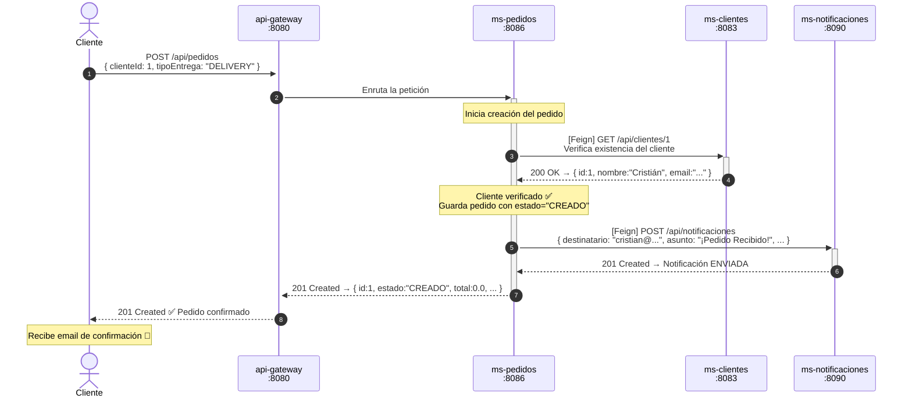
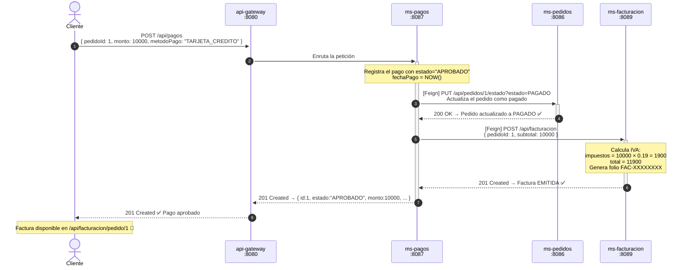
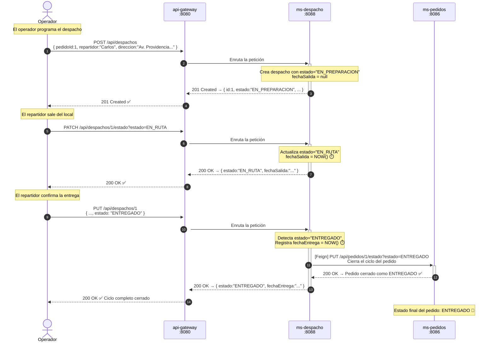
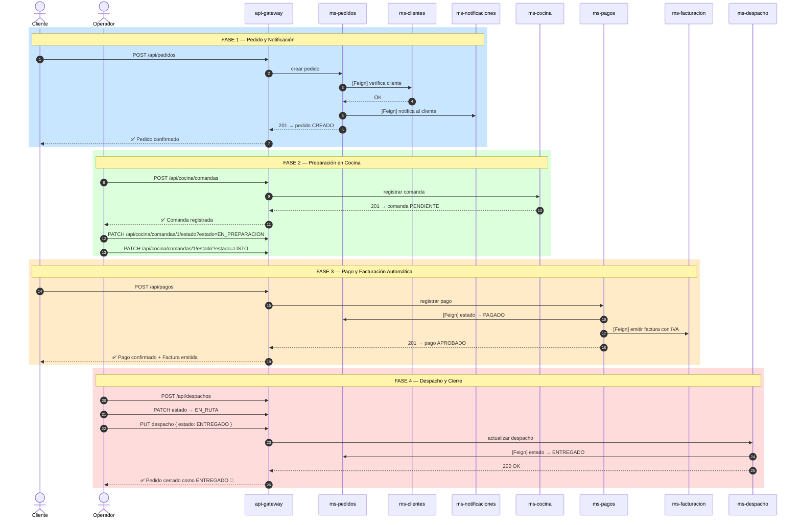

# 🔄 Diagrama de Secuencia — Flujo Completo de un Pedido

> Muestra la interacción cronológica entre todos los microservicios desde que un cliente hace un pedido hasta que lo recibe en su domicilio.  
> Generado con **Mermaid Sequence Diagram** syntax.

---

## Flujo 1: Creación de Pedido (con Notificación Automática)

---

## Flujo 2: Registro de Pago (con Actualización de Pedido y Facturación)

---

## Flujo 3: Despacho a Domicilio (Cierre del Ciclo del Pedido)

---

## Flujo 4: Flujo Completo Integrado (Resumen)

---

## Resumen de Interacciones por Fase

| Fase | Acción | Servicios involucrados |
|------|--------|------------------------|
| **1. Pedido** | Cliente realiza orden | Gateway → ms-pedidos → ms-clientes (Feign) → ms-notificaciones (Feign) |
| **2. Cocina** | Chef prepara la comanda | Gateway → ms-cocina |
| **3. Pago** | Cliente paga la cuenta | Gateway → ms-pagos → ms-pedidos (Feign) → ms-facturacion (Feign) |
| **4. Despacho** | Repartidor entrega | Gateway → ms-despacho → ms-pedidos (Feign) |

---

## Escenarios de Error y Tolerancia a Fallos

| Escenario | Comportamiento del sistema |
|-----------|---------------------------|
| ms-clientes no disponible al crear pedido | ms-pedidos lanza excepción `RuntimeException`, pedido no se crea |
| ms-notificaciones no disponible | El pedido **sí se crea** — solo se registra un `log.error` (fallo silencioso) |
| ms-pedidos no disponible al pagar | El pago **sí se registra** en pagos_db — se loguea error de Feign |
| ms-facturacion no disponible al pagar | El pago **sí se registra** — la factura deberá emitirse manualmente |
| ms-pedidos no disponible al entregar | El despacho se marca `ENTREGADO` localmente — se loguea error de Feign |
